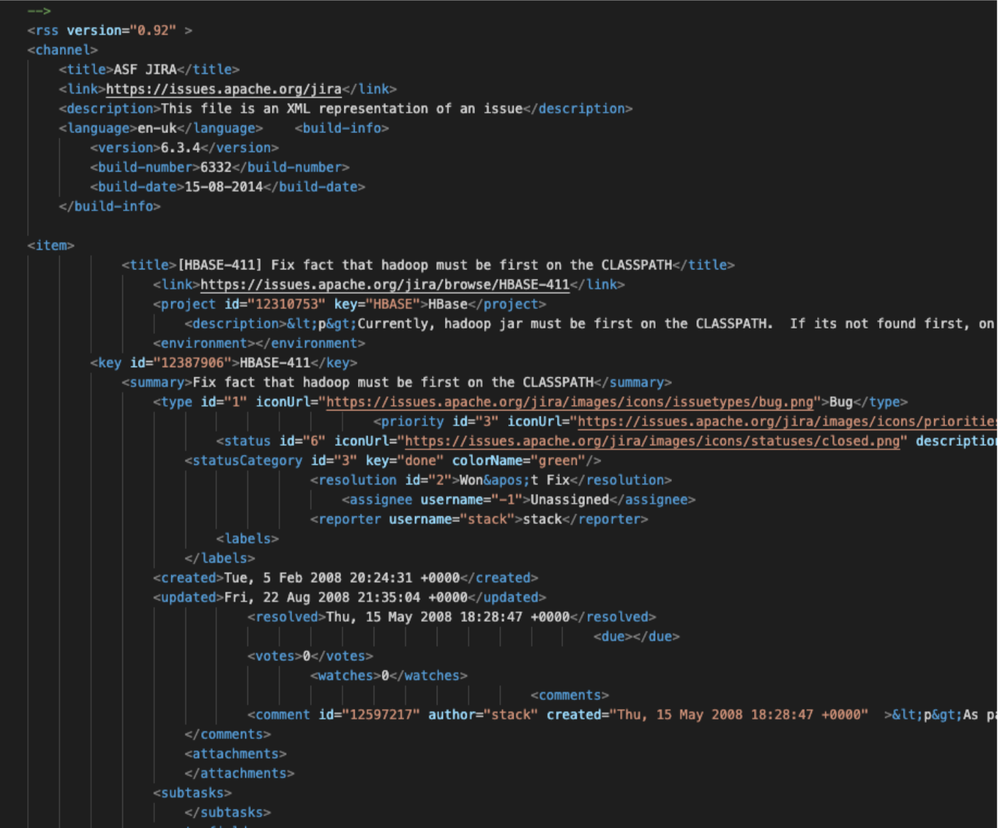
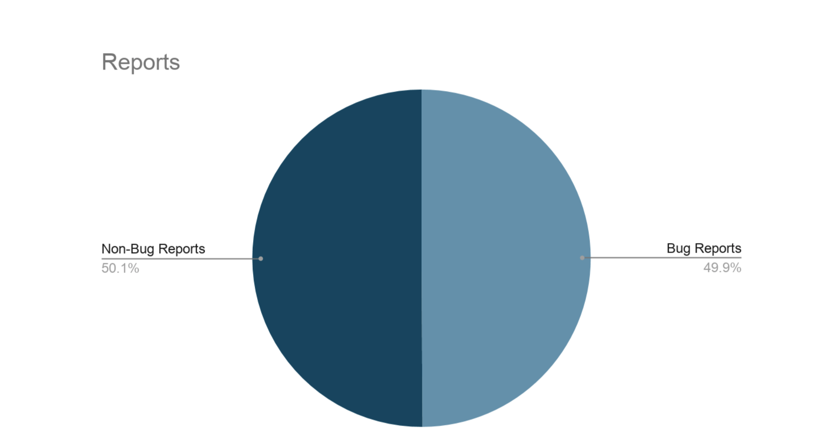
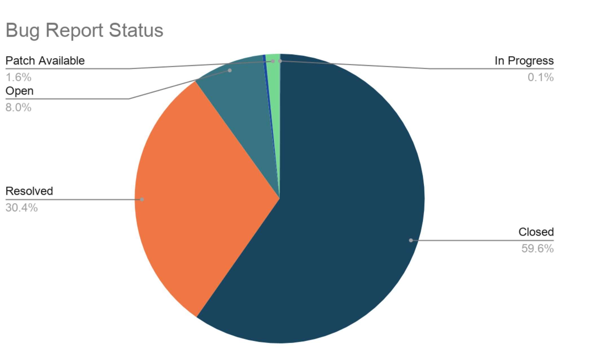

# SoftwareTesting


We are given many XML files inside the hbaseBugReport.zip. Each one of those XML files inside corresponds to a given bug report. 

1. There are various kinds of issue reports in HBase (e.g., bugs, enhancements, tasks, etc.). Each issue report can be in different stages (e.g., open, closed, fixed, etc.) Among all these issue reports, which belong to the “bug” type, how many of them are there in total?
2. Among the total number of “bugs”, give a quantitative report on their current state. In other words, report the number of bug reports which are in different states (a.k.a., open, closed, or fixed, etc.).
3. Among the “bug type” issue reports, which are either “fixed” or “closed”, what are minimum,
average, median, and maximum bug resolution time?

Below, you can visualize what a sample XML file looks like:




## HBase

HBase is a well known open source NoSQL information base, demonstrated after Google's BigTable (https://static.googleusercontent.com/media/research.google.com/en//file/bigtable-osdi06.pdf). 

Not the same as Firefox, HBase utilizes Jira as its issue global positioning framework.

### Requirements

You will need to install a version of python3
Note: python 3 and 2 can be used simultaneously.

* python3
  ```sh
  $ install python3 python3-pip
  ```

Also, you will need to download the statistics and BeautifulSoup libraries.
* opencv
  ```sh
  $ pip3 install bs4
  $ pip3 install statistics
  
  ```

### Installation

1. Clone the repo
   ```sh
   git clone https://github.com/ahmedwab/SoftwareTesting
   ```
2. Move the pyhton file along with all the XML files

3. Run the webcam.py program
   ```sh
    python3 search.py
   ```
   
### Results

Number of Reports: 17257
Number of Bug reports: 8614
{'In Progress': 7, 'Closed': 5138, 'Resolved': 2615, 'Open': 691, 'Reopened': 27, 'Patch Available': 136}
Analysis of Fixed or Closed bugs:
Fastest fix(days): 0
Slowest fix(days): 2024
Median fix(days): 2
Average fix(days): 31.47






